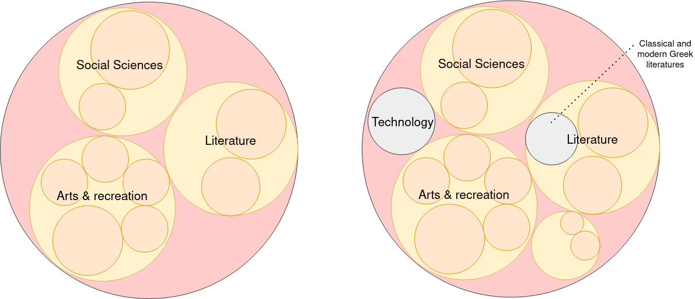

[x] Add docker info
[ ] Afer logging in, redirect to options: /<user_id>/circlepacking or /<user_id>/bookshelf
[ ] Add internal auth method - using tokens

# Wrec-API
[](https://github.com/RichardLitt/standard-readme)

Visualize your book consumption and reading biases using the dewey decimal system.

## Run program

### Web
1. `1/login` Choose a login method. Then follow the url path to login into Goodreads. Make sure this is the method you normally use for logging in.
- Alternatively, you can go straight to the login URL via third party (Ex: /login/amazon) and submit your username, password, and name.
2. After logging in, the site will ask how'd you'd like to see your books displayed. Circle Packing or a list/

### Docker
Run the dockerfile locally:

```
docker run -dp 5000:5000 -w /app -v "$(pwd):/app" IMAGE_NAME sh -c "flask run --host 0.0.0.0"
```


## Table of Contents
- [Background](#background)
- [Install](#install)
- [Environment variables](#env-variables)
- [API Endpoints](#api-endpoints)
- [Contributing](#contributing)
- [License](#license)


## Background
A data visualization on books you've read may look something like the image on the left - assuming the orange circles represent books. However I want to see the book genres I'm NOT reading, so ideally it'll look like something on the right.


The purpose of this project is to compare a user's book classifications to the total available classifications. One option for this is to use the Dewey Decimal System and nesting the three levels of categories:

```
Level 1: 10 categories
Level 2: 100 categories
Level 3: 1000 categories
```

[D3 Zoomable Circle Packing Visualization](http://jeromefroe.github.io/circlepackeR/) makes it easy to show nested dewey decimal categories and a user's corresponding books by using this [JSON structure](https://gist.githubusercontent.com/mbostock/1093025/raw/05621a578a66fba4d2cbf5a77e2d1bb3a27ac3d4/flare.json). See [API Endpoints](#api-endpoints) section below to render a circle packing json.

API stack:
- Flask
- PostGreSQL - hosted on ElephantSQL
- Deployed - docker image on Render

This project was inspired by Neil Pasricha's blog post [8 More Ways To Read (A Lot) More Books](https://www.neil.blog/articles/8-more-ways-to-read-a-lot-more-books#yui_3_17_2_1_1687286122789_289) and partially by Morgan Housel's blog post [How to Read: Lots of Inputs and a Strong Filter ](https://collabfund.com/blog/how-to-read-lots-of-inputs-and-a-strong-filter/).


I would love extend this idea to music and movies too!

## Install
1. You can either clone the project by running`git clone https://github.com/tas09009/Wrec-API.git` in your terminal or fork the project in order to contribute later: See [Contributing](#contributing) below.

#TODO: This all needs to be updated
1. Set up your Python virtual environment by running `pyvenv venv` in that directory and running `source venv/bin/activate` to active it. Or create a conda environment.
2. make sure `pip` is installed
3. Install Python requirements with `pip install -r requirements.txt`. You may need to install some [build prerequisites](https://www.psycopg.org/docs/install.html#build-prerequisites); on Debian-like systems, they include the packages `python3-dev` and `libpq-dev`. You can try running `pip install psycopg2-binary` first to see if that solves the issue.
4. Install PostgreSQL and create an empty database by running `createdb wrec` in your terminal
5. Create the models by running `flask db upgrade` in your terminal. The migration scripts in here will create three models of the dewey decimal levels.
7. At your terminal run `flask run`. Click on development server shown in your terminal [http://127.0.0.1:5000/](http://127.0.0.1:5000/)

*Here are some files which you may find helpful when diving into the project:*
- `wrec-schema.jpg` - diagram of all the models
- `classify_api_flowchart.jpg` - This project utilizes the [Classify API](http://classify.oclc.org/classify2/api_docs/index.html) to convert ISBN values to their respective dewey decimal numbers. However, the process isn't straightforward as the API actually returns an XML document of that particular book's data. The XML is converted to JSON, then parsed to find the dewey number value. This process isn't standard hence, a flowchart of the algorithm needed to be created to clarify the steps. There are still some methods missing which need to be added to the flowchart. Here is a snippet of the flowchart:


## Environment variables
Create a `.env` file at the project level by copying the `.env.example` file:
`cp .env.example .env`

## API Endpoints
Please reference this [Swagger documentation](https://wrec-api.onrender.com/swagger-ui).

## Contributing
Please follow along this excellent [step-by-step guide](https://www.dataschool.io/how-to-contribute-on-github/) to learn how to contribute to an open-source project

## License