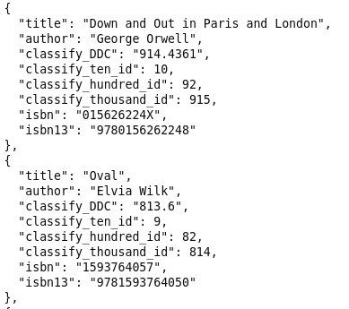

# Wrec-API

Visualize your book consumption using the dewey decimal system to find your reading biases.
## Table of Contents
- [Background](#background)
- [Install](#install)
- [Environment variables](#env-variables)
- [API Endpoints](#api-endpoints)
- [Contributing](#contributing)
- [License](#license)

## Background
This idea started off with the "unknown unknowns" when it comes to consuming things like books, music and movies. Every recommendation system is trying to keep you within your bubble of interests but we want to try something our of your consumption bubble. Here is an example:

*The visualization on the left shows what most data visualization charts will show: what you read and how much. The visualization on the right also shows what you DON'T read, represented here by gray circles*

The purpose of this project is to compare a user's book classifications to the total available classifications. One way this is done is by using the Dewey Decimal System.

[D3 Zoomable Circle Packing Visualization](http://jeromefroe.github.io/circlepackeR/) makes it easy to show nested dewey decimal categories and a user's corresponding books by using this [JSON structure](https://gist.githubusercontent.com/mbostock/1093025/raw/05621a578a66fba4d2cbf5a77e2d1bb3a27ac3d4/flare.json). See [API Endpoints](#api-endpoints) section below to render a circle packing json.

This project uses the Flask framework for designing the API, PostgreSQL as the database and Heroku for deployment.

## Install
1. You can either clone the project by running`git clone https://github.com/singhshemona/recommmend.git` in your terminal or fork the project in order to contribute later: See [Contributing](#contributing) below.

1. Set up your Python virtual environment by running `pyvenv venv` in that directory and running `source venv/bin/activate` to active it. Or create a conda environment.
2. make sure `pip` is installed
3. Install Python requirements with `pip install -r requirements.txt`. You may need to install some [build prerequisites](https://www.psycopg.org/docs/install.html#build-prerequisites); on Debian-like systems, they include the packages `python3-dev` and `libpq-dev`. You can try running `pip install psycopg2-binary` first to see if that solves the issue.
4. Install PostgreSQL and create an empty database by running `createdb wrec` in your terminal
5. Create the models by running `flask db upgrade` in your terminal
7. At your terminal run `flask run`. Click on development server shown in your terminal [http://127.0.0.1:5000/](http://127.0.0.1:5000/)
8. Then go to each of the following endpoints to upload the tens, hundreds and thousands csv files. The csv files are located in the `/app/externalFiles/DDS_directory_structure`. The corresponding file needs to be uploaded at it's respective endpoint:
	- DDSGORun0.csv > `/category/ten/upload`
	- DDSGORun1.csv > `/category/hundred/upload`
	- DDSGORun2.csv > `/category/thousand/upload`

*Here are some files which you may find helpful when diving into the project:*
- `wrec-schema.jpg` - diagram of all the models
- `classify_api_flowchart.jpg` - This project utilizes the [Classify API](http://classify.oclc.org/classify2/api_docs/index.html) to convert ISBN values to their respective dewey decimal numbers. However, the process isn't straightforward as the API actually returns an XML document of that particular book's data. The XML is converted to JSON, then parsed to find the dewey number value. This process isn't standard hence, a flowchart of the algorithm needed to be created to clarify the steps. There are still some methods missing which need to be added to the flowchart. Here is a snippet of the flowchart:

## Environment variables
Create a `.env` file at the project level and add the following:

- `FLASK_APP` = wrec.py
- `FLASK_DEBUG` = 1
- `SECRET_KEY` = A 24 character random string can be generated by running `python` in your terminal and typing the following one line at a time: `import secrets`, `secrets.token_hex(24)`
- `DATABASE_URL`=postgresql:///wrec
- `FLASK_CONFIG`=development

## API Endpoints
Documentation will be created in [Swagger](https://swagger.io/). For now, here is a quick guide:

User Navigation
- Registration - *need to implement* 

	For now use:
	- email=`john@example.com`
	- password=`cat`
- Login: `/auth/login`
- Logout: `/auth/logout`

Upload books:
`/api/v1/books/upload` - import csv file from goodreads

Display book data:

`/list_of_books` - see user's book data

`/circlepacking` - [Circle Packing Visualization](http://jeromefroe.github.io/circlepackeR/)

`/ten_categories` - books grouped by [ten categories](https://github.com/tas09009/Wrec-API/blob/main/externalFiles/dewey_classifications/DDSGORun0.csv)

`/hundred_categories` - books grouped by [hundred categories](https://github.com/tas09009/Wrec-API/blob/main/externalFiles/dewey_classifications/DDSGORun1.csv)

`/thousand_categories` - books grouped by [thousand_categories](https://github.com/tas09009/Wrec-API/blob/main/externalFiles/dewey_classifications/DDSGORun2.csv)

## Contributing
Please follow along this excellent [step-by-step guide](https://www.dataschool.io/how-to-contribute-on-github/) to learn how to contribute to an open-source project

## License